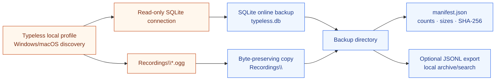

<div align="center">

# Typeless Backup

**Own your voice conversations. Keep your local history.**

A privacy-first, read-only backup and archival tool for Typeless on Windows and macOS.
Preserve the local SQLite database and linked OGG recordings without uploading your conversations anywhere.

<p>
  <a href="./README.zh-CN.md">简体中文</a> ·
  <a href="https://github.com/NeoWeb3Nova/typeless-backup/issues">Issues</a> ·
  <a href="https://github.com/NeoWeb3Nova/typeless-backup">Repository</a>
</p>

<p>
  <a href="https://github.com/NeoWeb3Nova/typeless-backup/blob/main/LICENSE"></a>
  <a href="https://www.python.org/"></a>
  <a href="https://www.sqlite.org/backup.html"></a>
  <a href="https://www.microsoft.com/windows"></a>
</p>

</div>

---

## Why this exists

Typeless stores conversation history locally. When pricing, quotas, or product policies change, users should still be able to retain the conversations and recordings they created.

**Typeless Backup** makes that preservation explicit and reproducible:

- open the source database read-only;
- create a consistent SQLite snapshot;
- copy the linked OGG recordings;
- write a machine-readable manifest with counts, sizes, and hashes;
- optionally export conversation records as JSONL for local search and archival.

Your data stays on your machine. This repository contains the tool, not anyone's conversations.

## What it does — and does not do

| Capability | Status |
|---|---|
| Back up `typeless.db` | Supported |
| Copy linked `Recordings/*.ogg` files | Supported |
| Preserve a consistent SQLite snapshot | Supported |
| Generate a manifest with integrity metadata | Supported |
| Export records to JSONL | Supported |
| Upload data to a server | **Never** |
| Modify or delete the Typeless source | **Never** |
| Import history into Doubao or another voice service | Not in scope |
| Transcribe or translate audio | Not in scope |

## Architecture



## Quick start

### Requirements

- Windows or macOS with Typeless installed
- Python 3.10 or later
- Read access to the Typeless local profile
- An empty destination directory or a new destination path

No third-party Python packages are required.

### Create a backup

Open PowerShell in this repository:

```powershell
python .\typeless_backup.py backup `
  --output "D:\TypelessBackups\typeless-2026-09-19"
```

The tool searches the platform's known application-data roots for a profile containing `typeless.db` and `Recordings/`. It does not depend on a fixed username or WSL path. To specify a profile explicitly:

```powershell
python .\typeless_backup.py backup `
  --source "$env:APPDATA\Typeless.exe" `
  --output "D:\TypelessBackups\typeless-2026-09-19"
```

On macOS:

```bash
python3 ./typeless_backup.py backup \
  --output "$HOME/TypelessBackups/typeless-2026-09-19"
```

A successful backup contains:

```text
D:\TypelessBackups\typeless-2026-09-19\
├── typeless.db
├── Recordings\
│   └── *.ogg
└── manifest.json
```

### Export records to JSONL

The export is generated from the backup, not from the live application data:

```powershell
python .\typeless_backup.py export-jsonl `
  --backup "D:\TypelessBackups\typeless-2026-09-19" `
  --output "D:\TypelessBackups\typeless-2026-09-19\history.jsonl"
```

Each line is one conversation record. Audio remains as separate OGG files and is referenced by a relative path such as `Recordings/<file>.ogg`.

## Data and integrity model

The backup is deliberately simple and inspectable:

| Artifact | Purpose |
|---|---|
| `typeless.db` | SQLite snapshot of the local Typeless history database |
| `Recordings/*.ogg` | Original local voice recordings, copied byte-for-byte |
| `manifest.json` | Backup format, creation time, database SHA-256, file count, byte count, and database statistics |
| `history.jsonl` | Optional line-delimited export of `history_v2` records |

The source database is opened in read-only mode and copied through SQLite's online backup API. The destination database is checked with `PRAGMA integrity_check`. The command refuses to overwrite a non-empty destination.

## Privacy and security

This tool is designed for personal archives, not cloud synchronization.

- **No network calls:** the backup command does not upload or transmit your data.
- **Read-only source:** it does not update, delete, vacuum, or migrate the Typeless database.
- **Local destination only:** choose a drive or folder you control.
- **Private output:** backups contain conversation text and audio. Protect them like personal records.
- **Do not commit backups:** never place `typeless.db`, `Recordings`, `*.ogg`, or `history.jsonl` in a public repository.
- **Encryption is your responsibility:** use BitLocker, an encrypted archive, or an access-controlled backup disk when appropriate.

This project does not claim to defeat operating-system permissions, disk encryption, Typeless account controls, or future changes to the Typeless storage format.

## Known scope and limitations

- The tool supports Windows and macOS only. It discovers candidate local profiles and validates that each contains `typeless.db` and `Recordings/`; use `--source` when your Typeless version uses another location.
- Linux and WSL are development environments only and are intentionally rejected by the backup CLI.
- It is a backup and archival utility, not a Typeless replacement.
- It does not import records into Doubao or another voice application.
- It does not convert OGG audio, run speech recognition, or translate transcripts.
- A live application may continue writing new records while a backup is created. SQLite provides a consistent database snapshot; close Typeless first if you need a strict application-level freeze.
- Always verify the manifest and keep the original source until you have independently confirmed the backup.

## Development

Run the self-contained test suite:

```bash
python -m unittest discover -s tests -v
```

The tests use a temporary SQLite database and synthetic audio bytes. They never access a user's Typeless profile.

## Contributing

Issues and focused pull requests are welcome.

1. Open an issue describing the observed storage layout, failure, or proposed improvement.
2. Do not attach real conversation databases, audio, transcripts, credentials, or tokens.
3. Use synthetic fixtures or a schema-only reproduction.
4. Run the test suite and `git diff --check` before opening a pull request.

For security-sensitive reports, avoid publishing private data in an issue. Until a dedicated security policy is added, use a private GitHub contact channel and include only the minimum reproducible details.

## Roadmap

The project intentionally prioritizes safe preservation before adding migration features.

- [x] Read-only SQLite snapshot
- [x] Recording preservation
- [x] Manifest and integrity checks
- [x] JSONL archival export
- [ ] Versioned schema compatibility notes
- [ ] Optional encrypted archive workflow
- [x] Windows/macOS candidate profile discovery

Import adapters, cloud sync, and automatic transcription are deliberately not part of the current roadmap.

## License

Released under the [MIT License](./LICENSE).

## Acknowledgements

Built with Python's standard library and SQLite's online backup API. The project is intentionally dependency-light so the backup path remains easy to inspect and reproduce.
