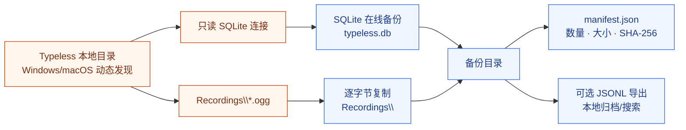

<div align="center">

# Typeless Backup

**掌握你的语音对话，保存你的本地记录。**

面向 Windows 和 macOS Typeless 的隐私优先、只读备份与归档工具。
保存本地 SQLite 数据库及其关联的 OGG 录音，不向任何服务器上传你的对话内容。

<p>
  <a href="./README.md">English</a> ·
  <a href="https://github.com/NeoWeb3Nova/typeless-backup/issues">问题反馈</a> ·
  <a href="https://github.com/NeoWeb3Nova/typeless-backup">代码仓库</a>
</p>

<p>
  <a href="https://github.com/NeoWeb3Nova/typeless-backup/blob/main/LICENSE"></a>
  <a href="https://www.python.org/"></a>
  <a href="https://www.sqlite.org/backup.html"></a>
  <a href="https://www.microsoft.com/windows"></a>
</p>

</div>

---

## 为什么需要它

Typeless 会在本地保存语音对话记录。当产品价格、额度或服务策略发生变化时，用户仍然应该能够保留自己创建的对话和录音。

**Typeless Backup** 将这件事变成明确、可复现的本地流程：

- 以只读方式打开源数据库；
- 创建一致的 SQLite 快照；
- 复制数据库关联的 OGG 录音；
- 生成包含数量、大小和哈希值的机器可读清单；
- 可选地将对话记录导出为 JSONL，用于本地搜索和归档。

你的数据留在自己的设备上。本仓库只包含工具，不包含任何人的对话内容。

## 作为 Hermes Skill 安装

本仓库本身就是一个可安装的 Hermes Skill。将仓库克隆到 Hermes 的 skills 目录即可；根目录的 `SKILL.md` 是 Skill 入口，`typeless_backup.py` 是本地执行程序：

```bash
git clone https://github.com/NeoWeb3Nova/typeless-backup.git ~/.hermes/skills/typeless-backup
```

在 Windows 上，将仓库克隆到 `%USERPROFILE%\.hermes\skills\typeless-backup`。安装后重新启动 Hermes 会话，使 Skill 目录重新加载。

## 你的语音历史，也是你的数字生活记录

语音对话不只是应用数据库里的几行记录。里面可能有你的想法、决定、记忆、工作笔记，以及某个时刻真实的思考过程。连同转写文本和录音，它们构成了很难重新创造的个人数字记录。

因此，保存数据也是一种知情和主动的控制：

- **知道自己留下了什么**：了解哪些对话和录音正在本地保存。
- **保留自己能控制的副本**：在卸载应用、更换设备，或服务的价格、额度和访问规则可能变化之前，先把重要记录保存下来。
- **把选择权留给未来的自己**：备份并不要求你迁移到任何其他服务，只是保留之后继续选择的可能。

本项目不对数据权属作法律判断，也不创造取决于当地法律或服务条款的额外权利。它遵循一个实际原则：不应仅仅因为产品发生变化，个人记录就变得无法访问。如果这些对话由你创建，保留一份私密的本地副本，是对隐私、连续性和数据可携带性的合理保护。

**先保存，再决定。**

## 能做什么，以及不能做什么

| 能力 | 状态 |
|---|---|
| 备份 `typeless.db` | 支持 |
| 复制关联的 `Recordings/*.ogg` | 支持 |
| 保存一致的 SQLite 快照 | 支持 |
| 生成包含完整性信息的 manifest | 支持 |
| 将记录导出为 JSONL | 支持 |
| 导出普通人可读的 Markdown 历史 | 支持 |
| 向服务器上传数据 | **永不支持** |
| 修改或删除 Typeless 源数据 | **永不支持** |
| 导入豆包或其他语音软件 | 当前范围之外 |
| 转写或翻译音频 | 当前范围之外 |

## 架构



## 快速开始

### 环境要求

- 已安装 Typeless 的 Windows 或 macOS 系统
- Python 3.10 或更高版本
- 对 Typeless 本地目录具有读取权限
- 一个空的目标目录，或一个尚不存在的目标路径

不需要安装第三方 Python 依赖。

### 创建备份

在本仓库目录打开 PowerShell：

```powershell
python .\typeless_backup.py backup `
  --output "D:\TypelessBackups\typeless-2026-09-19"
```

工具会在平台应用数据目录中搜索包含 `typeless.db` 和 `Recordings/` 的候选目录，不依赖固定用户名或 WSL 路径。也可以显式指定源目录：

```powershell
python .\typeless_backup.py backup `
  --source "$env:APPDATA\Typeless.exe" `
  --output "D:\TypelessBackups\typeless-2026-09-19"
```

在 macOS 上：

```bash
python3 ./typeless_backup.py backup \
  --output "$HOME/TypelessBackups/typeless-2026-09-19"
```

备份成功后，目录结构如下：

```text
D:\TypelessBackups\typeless-2026-09-19\
├── typeless.db
├── Recordings\
│   └── *.ogg
└── manifest.json
```

### 导出 JSONL 记录

导出基于备份目录，而不是直接读取正在运行的应用数据：

```powershell
python .\typeless_backup.py export-jsonl `
  --backup "D:\TypelessBackups\typeless-2026-09-19" `
  --output "D:\TypelessBackups\typeless-2026-09-19\history.jsonl"
```

每一行对应一条对话记录。音频仍以独立 OGG 文件保存，并通过类似 `Recordings/<file>.ogg` 的相对路径引用。

### 导出可直接阅读的历史记录

`history.jsonl` 是面向程序的导出格式，在普通编辑器中会比较密集。要生成带时间、转写文本和音频引用的可读版本：

```powershell
python .\typeless_backup.py export-markdown `
  --backup "D:\TypelessBackups\typeless-2026-09-19" `
  --output "D:\TypelessBackups\typeless-2026-09-19\history.md"
```

然后用 VS Code、Typora、Obsidian 或其他 Markdown 阅读器打开 `history.md`。

## 数据与完整性模型

备份结构保持简单、透明、易检查：

| 文件 | 用途 |
|---|---|
| `typeless.db` | Typeless 本地历史数据库的 SQLite 快照 |
| `Recordings/*.ogg` | 原始本地语音录音，按字节复制 |
| `manifest.json` | 备份格式、创建时间、数据库 SHA-256、文件数量、字节数和数据库统计 |
| `history.jsonl` | 可选的 `history_v2` 记录逐行导出文件 |
| `history.md` | 可选的普通人可读历史记录，包含时间和音频引用 |

源数据库以只读模式打开，并通过 SQLite Online Backup API 复制。目标数据库会执行 `PRAGMA integrity_check` 校验。目标目录非空时，工具会拒绝覆盖。

## 隐私与安全

这个工具面向个人归档，而不是云端同步。它帮助你在不把数据交给其他服务的前提下，对真正重要的个人记录保留实际控制权。

- **不进行网络请求**：备份命令不会上传或传输你的数据。
- **源数据只读**：不会更新、删除、清理或迁移 Typeless 数据库。
- **目标留在本地**：请使用自己控制的磁盘或目录。
- **输出属于私密数据**：备份包含对话文本和音频，应按个人记录保护。
- **不要提交备份**：不要把 `typeless.db`、`Recordings`、`*.ogg` 或 `history.jsonl` 放入公开仓库。
- **加密由用户负责**：必要时使用 BitLocker、加密压缩包或受访问控制的备份磁盘。

本项目不声称能够绕过操作系统权限、磁盘加密、Typeless 账号控制，或未来 Typeless 对本地存储格式的调整。

## 当前范围与限制

- 当前支持 Windows 和 macOS。工具会动态发现候选本地目录，并验证其中存在 `typeless.db` 和 `Recordings/`；如果你的 Typeless 版本使用其他位置，请通过 `--source` 指定。
- Linux 和 WSL 仅作为开发环境，备份 CLI 会明确拒绝 Linux 运行环境。
- 这是备份与归档工具，不是 Typeless 替代品。
- 不支持将记录导入豆包或其他语音软件。
- 不转换 OGG 音频，不运行语音识别，也不翻译转写文本。
- 应用运行期间可能继续写入新记录。SQLite 能提供一致的数据库快照；如果需要应用层面的严格冻结，请先关闭 Typeless。
- 在独立确认备份有效前，请始终保留原始数据和源目录。

## 开发

运行自包含测试：

```bash
python -m unittest discover -s tests -v
```

测试使用临时 SQLite 数据库和模拟音频字节，不会访问用户的 Typeless 目录。

## 参与贡献

欢迎提交 Issue 和聚焦明确的 Pull Request。

1. 描述你观察到的存储布局、错误或改进建议。
2. 不要上传真实对话数据库、音频、转写文本、凭证或 Token。
3. 使用模拟数据，或提供只包含 schema 的复现样例。
4. 提交 Pull Request 前运行测试和 `git diff --check`。

对于安全敏感问题，不要在公开 Issue 中发布私人数据。在专门的安全政策建立前，请通过 GitHub 私密联系渠道反馈，并只提供最小复现信息。

## 路线图

项目优先保证安全保存，再考虑迁移能力。

- [x] 只读 SQLite 快照
- [x] 录音文件保留
- [x] manifest 与完整性校验
- [x] JSONL 归档导出
- [ ] 版本化 schema 兼容说明
- [ ] 可选的加密归档流程
- [x] Windows/macOS 候选目录发现

导入适配器、云同步和自动转写目前不在路线图中。

## 许可证

本项目采用 [MIT License](./LICENSE) 开源。

## 致谢

本项目基于 Python 标准库和 SQLite Online Backup API 构建。依赖保持精简，是为了让备份路径更容易检查、理解和复现。
